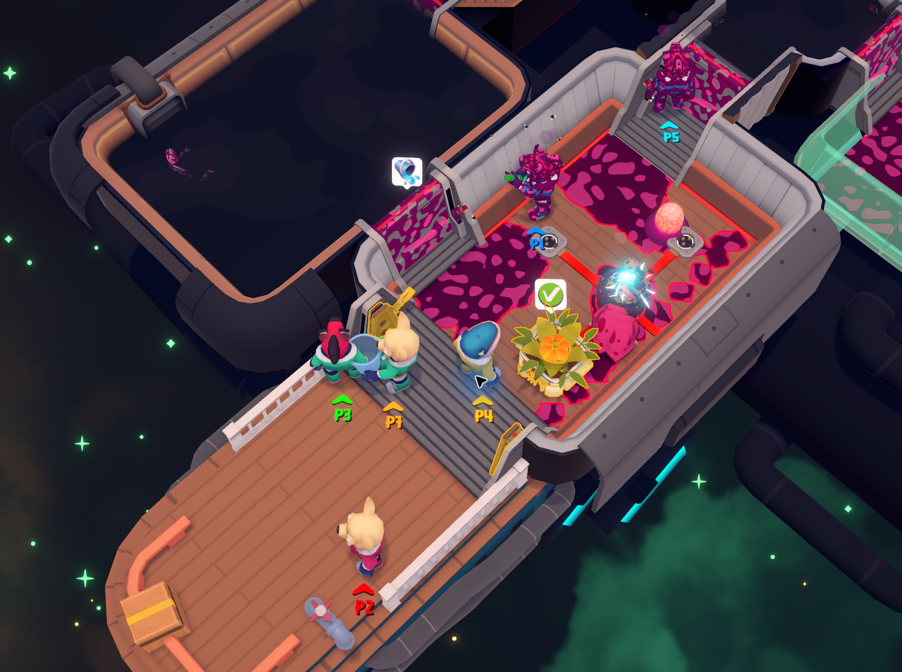

# Out of Space — More Local Players

A working prototype for **4–16 players on one Windows PC**. Default: 16 available slots. Tested against Steam build **6616527**, game **v1.2.4b13**, Unity **2018.2.21f1**.



Gameplay screenshot provided by Clay.

Download this repository as a ZIP using GitHub's **Code → Download ZIP**, extract it, and run `install.ps1` as described below. The compiled plugin is included in `release/`.

## Play

1. Launch Out of Space from Steam after installation.
2. Start a match and press a button on each controller to join.
3. Select **Ready** for a local game. Press a button again when the loading screen asks you to continue.
4. Press **F8** to see detected controllers, their player assignments, and the game roster.

The keyboard shares its configured player slot with that player's controller, as in the original game. Sixteen slots do not require sixteen people to join.

## Configuration

The game creates `BepInEx/config/local.outofspace.moreplayers.cfg` on first launch. Close the game before editing.

```ini
[Players]
MaxLocalPlayers = 16

[Input]
DisableXInput = false

[Diagnostics]
ShowOverlay = false
```

`MaxLocalPlayers` accepts 4–16. All changes require restarting the game, except the F8 display toggle.

`DisableXInput = false` preserves the native input backend, including Xbox vibration and mappings. Classic XInput exposes at most four Xbox-style devices; other natively detected controllers can fill additional slots. The current mixed setup enumerated six devices: four XInput controllers, a DualSense, and a DualShock 4.

`DisableXInput = true` requests the installed Rewired Raw Input backend without XInput. This is an experimental option for larger Xbox-heavy mixes; hardware detection, trigger mappings, and rumble need checking. It is not a promise that every Windows controller combination will work. Avoid wrapping every controller as XInput when you need more than four XInput devices. See [Rewired's input guidance](https://guavaman.com/projects/rewired/docs/HowTos.html) and [known issues](https://guavaman.com/projects/rewired/docs/KnownIssues.html).

## What the mod changes

- Adds Rewired player definitions before initialization, copying the stock player mappings and preserving the reserved system entry.
- Extends verified lobby and mid-game input loops and guards against duplicate/full joins.
- Creates complete lobby panels and character previews for each additional slot.
- Extends spawn positions, player identification, stamina UI, and shop colors.
- Restores controller ownership by device identity across scene changes and reconnects. One detected controller is assigned to one player.
- Uses the game's existing camera target registration for every spawned character.
- Keeps `GameValue` conversions on their four-player settings above four players. Other stock difficulty calculations still see the actual roster size.
- Restricts groups larger than four to local play. This release does not expand online multiplayer.

The game assembly and Rewired assembly hashes are checked at startup. An unrecognized version disables this plugin's patches and logs the reason.

## Verification and limits

See [VALIDATION.md](VALIDATION.md) for the final test results. Sixteen logical players and characters were tested with simulated game input. The connected physical devices were enumerated and their assignments checked, but sixteen physical gamepads and a full couch session have not been tested.

The automated test also includes screenshots of the [sixteen-player game](sixteen-player-game.png) and [sixteen-slot lobby](sixteen-player-lobby.png).

This remains a prototype: expect crowding on small ships, repeated clothing textures, and possible balance issues. P1–P16 labels and colored indicators distinguish players. Ship size and achievements are unchanged. Use the ship sizes your save already unlocks.

## Install, build, disable

`install.ps1` installs the release DLL and, if needed, downloads the pinned BepInEx **5.4.23.5 x64** release from its official repository with a SHA-256 check. It refuses to overwrite an unrecognized loader or game version. Close the game first.

```powershell
.\install.ps1 -GameDir 'G:\SteamLibrary\steamapps\common\Out of Space'
.\build.ps1 -GameDir 'G:\SteamLibrary\steamapps\common\Out of Space'
.\disable.ps1 -GameDir 'G:\SteamLibrary\steamapps\common\Out of Space'
```

Building requires a .NET SDK, the local game's managed assemblies, and BepInEx 5. The release contains the mod DLL, not proprietary game or Rewired assemblies.

Disabling renames this plugin's DLL to `.disabled`; it leaves BepInEx and other mods installed. Run `install.ps1` again to re-enable it.

Diagnostic files live in the game directory:

- `BepInEx/LogOutput.log`: loading and patch errors.
- `BepInEx/MorePlayers-status.txt`: controller assignments and current roster.

## Research references

The installed assemblies were inspected locally. Existing public projects helped locate the relevant game systems; their source was not bundled into this release:

- [Phedg1Studios/OutOfSpaceMods](https://github.com/Phedg1Studios/OutOfSpaceMods): lobby and Rewired integration examples.
- [minimusubi/OutOfSpace-BetterSpace](https://github.com/minimusubi/OutOfSpace-BetterSpace): game-specific BepInEx setup and camera work.
- [BepInEx 5.4.23.5](https://github.com/BepInEx/BepInEx/releases/tag/v5.4.23.5): runtime loader.

Decompiled game source and test copies remain local working files and are not included in the deliverable.
